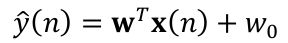
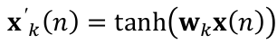

# 0. REGRESSÃO LINEAR: Previsão da temperatura mínima da cidade de Melbourne (AUS)

### Dataset utilizado
- Série temporal de temperatura mínima diária referente à cidade de Melbourne, Austrália, no período de 1981 a 1990. Dados retirados de: [Australian Bureau of Meteorology](http://www.bom.gov.au/)

### Objetivos - Parte 1
- desenvolver um modelo linear de previsão, tal que:

- Para este caso, os dados de 1990 são reservados para teste
- Além disso, utilizar um esquema de __validação cruzada do tipo k-fold__ para selecionar o melhor valor do hiperparâmetro K. Neste caso, o hiperparâmetro é o número de dias anteriores ao dia em que se deseja prever a temperatura os quais devem ser avaliados de K = 1 ... 30
- Como parâmetro de qualidade do modelo preditor, deve-se utilizar o valor __RMSE (root mean squared error)__

### Objetivos - Parte 2
- desenvolver um modelo linear de previsão que utiliza como entrada valores obtidos de transformações não-lineares do vetor __x(n)__. Em outras palavras, os atributos que efetivamente são linearmente combinados na predição resultam de mapeamentos não-lineares dos atrasos da série presentes no vetor original __x(n)__. No caso, devem ser gerados T atributos transformados como a seguir:

- Para k = 1, ..., T e sendo os vetores __Wk__ com componentes gerados aleatoriamente conforme distribuição uniforme
- Além disso, utilizar um esquema de __validação cruzada do tipo k-fold__ juntamente com a técnica de [Ridge Regression](https://towardsdatascience.com/ridge-regression-for-better-usage-2f19b3a202db) para selecionar o melhor valor de combinação para o par ($\lambda$, T), sendo $\lambda$ o coeficiente de Ridge. Neste caso, devem ser tomadas amostras de 5 dias anteriores para T = 1 ... 100 e os possíveis valores $\lambda$ devem ser buscados iterativamente seguindo uma lógica de busca
- Como parâmetro de qualidade do modelo preditor, deve-se utilizar o valor __RMSE (root mean squared error)__

# 1. CLASSIFICAÇÃO BINÁRIA: Identificador de gênero de voz

## Abordagem via Regressão Logística

### Dataset utilizado
- 19 atributos acústicos extraídos de trechos gravados de voz,
considerando a faixa de frequências de 0 a 280 Hz. A última coluna corresponde ao rótulo associado a cada padrão, sendo igual a ‘1’ para o gênero masculino, e ‘0’ para o gênero feminino. Dados retirados de: [MLData.io](https://www.mldata.io/dataset-details/gender_voice/)

# 2. CLASSIFICAÇÃO MULTICLASSE: Identificador de status de usuário de smartphone

## Abordagem via Regressão Logística com Softmax

### Dataset utilizado
- tributos nos domínios do tempo e da
frequência extraídos de sinais de acelerômetro e giroscópio de um smartphone. Os
rótulos correspondentes aos dados indicam qual a atividade realizada por um voluntário humano durante a aquisição dos sinais: 0 – caminhada; 1 – subindo escadas; 2 – descendo escadas; 3 – sentado; 4 – em pé; 5 – deitado.

# 3. CLASSIFICAÇÃO MULTICLASSE: Identificador de status de usuário de smartphone

## Abordagem via K-Nearstest Neighbors

### Dataset utilizado
- tributos nos domínios do tempo e da
frequência extraídos de sinais de acelerômetro e giroscópio de um smartphone. Os
rótulos correspondentes aos dados indicam qual a atividade realizada por um voluntário humano durante a aquisição dos sinais: 0 – caminhada; 1 – subindo escadas; 2 – descendo escadas; 3 – sentado; 4 – em pé; 5 – deitado.
